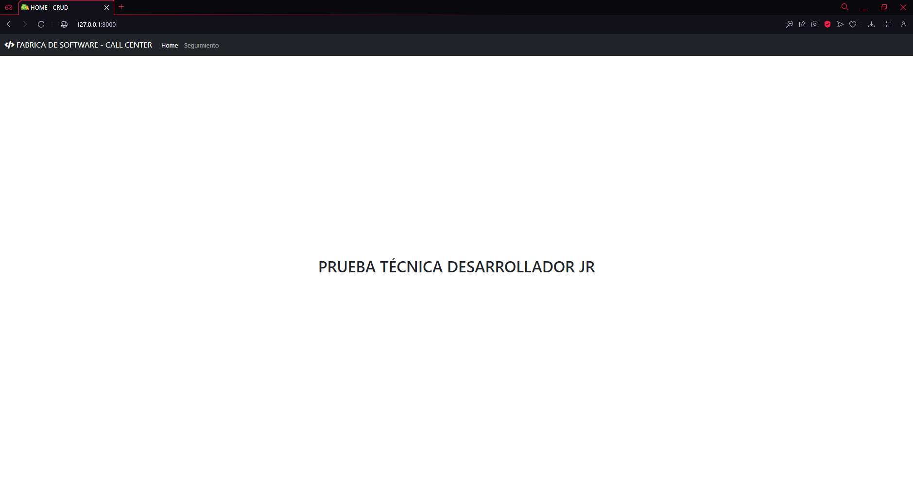
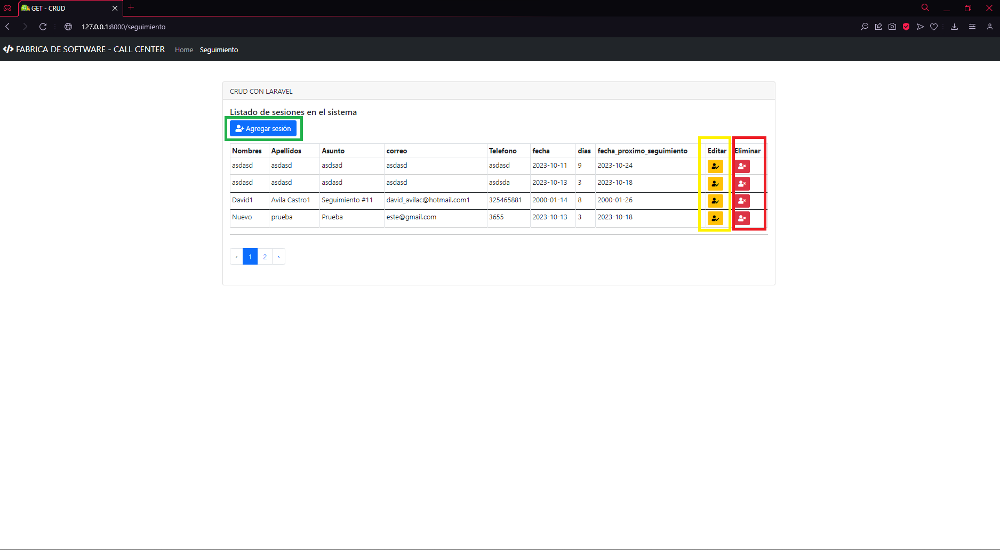
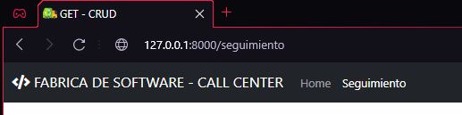
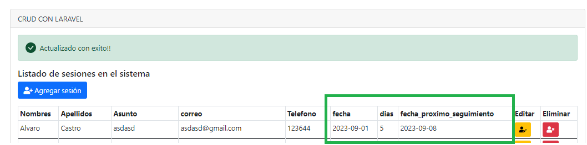

### Prueba Desarrollador JR - PD


### Parte I


¿En qué consiste la prueba?
Deberás construir una aplicación web para un call center, la cual permita la administración y visualización del seguimiento a los clientes. 

- **Home (página de inicio)**
Esta será la página principal la cual tendrá acceso a las siguiente opciones. 



- **Seguimiento:** la aplicación debe poder gestionar los seguimiento de los clientes diferente clientes.



#### **Funcionalidad**
1. El sitio web deberá tener un menú superior con el enlace a la opcion de seguimiento.


```html
<ul class="navbar-nav me-auto mb-2 mb-lg-0">
<li class="nav-item">
    <a class="nav-link @if(!empty($paginaActual) && $paginaActual == 'home') active @endif" aria-current="page" href="{{ route('home.index') }}">Home</a>
</li>
<li class="nav-item">
    <a class="nav-link @if(empty($paginaActual)) active @endif" href="{{ route('seguimientos.index') }}">Seguimiento</a>
</li>
</ul>
```

2. Crea una migración y un modelo para una tabla llamada "seguimientos" conlos siguientes campos: 
- id
- Nombres
- Apellidos
- Asunto
- correo
- Telefono
- fecha: Fecha del seguiminto actual. - dias: numero de dias
- fecha_proximo_seguimiento. Dato calculado por el sistema. segun laregla

```php
Schema::create('seguimientos', function (Blueprint $table) {
    $table->bigIncrements('id');
    $table->string('nombres');
    $table->string('apellidos');
    $table->string('asunto');
    $table->string('correo');
    $table->string('telefono');
    $table->date('fecha');
    $table->integer('dias');
    $table->date('fecha_proximo_seguimiento');
    $table->timestamps();
});
```

3. Crear un controlador y rutas
Crea un controlador llamado **"SeguimientoController"** con las accionesnecesarion para la implementacion de un CRUD.

```php
<?php

namespace App\Http\Controllers;

use App\Models\Seguimientos;
use Illuminate\Http\Request;

class SeguimientosController extends Controller
{

    public function index()
    {
        $datos = Seguimientos::orderBy('nombres')->paginate(4);
        return view('inicio', compact('datos'));
    }

    public function create()
    {
        return view('agregar');
    }

    public function show($id)
    {
        $seguimiento = Seguimientos::find($id);
        return view('eliminar', compact('seguimiento'));
    }
}
```

Se debe crear una funcion la cual calcule la fecha del proximo  seguimiento segun la cantidad de dias ingresados y la fecha actual del  seguimiento, esta fecha debe validar solo dias habilies excluyendo sabados y domingos. Este campo no sera posible su edicion desde el formulario. solo se mostrara modo de consulta.

```php
class Seguimientos extends Model
{
    use HasFactory;
    function calcularFechaProximoSeguimiento($fechaActual, $diasHabiles) {
        $fechaActual = new DateTime($fechaActual);
        for ($i = 0; $i < $diasHabiles; $i++) {
            $fechaActual->add(new DateInterval('P1D'));
            // Verifica si el día actual es sábado (6) o domingo (7)
            while ($fechaActual->format('N') >= 6) {
                $fechaActual->add(new DateInterval('P1D'));
            }
        }
        return $fechaActual->format('d/m/Y');
    }
}
```
Ejemplo:
- ➢ Fecha Actual 01/09/2023
- ➢ Dias Habiles: 5
- ➢ Proximo seguimiento: 08/09/2023
  


---------------

### Parte II

En qué consiste la prueba?
Deberás construir un procedimiento almacenada o bloque anonimo el cual permitala liquidacion de las facturas creadas en la base de datos PRUEBAS con las
siguentes reglas.

1. Calcular el valor total de los producto y almacenar el resultado en el campoVALOR. VALOR = ( precio unitario * cantidad )

2. Calcular el valor de IVA para cada producto segun su % iva y almacenar enel
campo VALOR_IVA. VALOR_IVA = (VALOR * IVA )

```sql

CREATE OR REPLACE PROCEDURE prc_detalle_factura_david_avila AS
BEGIN
    -- Calcular el valor total de la factura para todas las mercancías
    UPDATE DETALLE_FACTURA df
    SET df.VALOR = df.CANTIDAD * df.PRECIO,
        df.VALOR_IVA = (df.CANTIDAD * df.PRECIO) * (df.IVA / 100)
    WHERE df.ID_FACTURA IN (SELECT DISTINCT ID_FACTURA FROM DETALLE_FACTURA);

    DBMS_OUTPUT.PUT_LINE('Procedimiento completado');
END;
```

3. Totalizar el valor para cada factura segun su detalle en el campo VALOR
   
4. Totalizar el valor del IVA para cada factura segun su detalle en el campoIVA
   
5. Calcular el valor del descuento segun el % para cada factura. la base del descuento debe ser antes de iva. VALOR_DESCUENTO. 

6. Totalizar el valor de cada factura teniendo encuenta los decuentos mas losimpuestos en el campo VALOR_TOTAL

```sql

CREATE OR REPLACE PROCEDURE prc_factura_david_avila AS 
BEGIN 
    FOR factura_rec IN (SELECT DISTINCT ID_FACTURA FROM DETALLE_FACTURA) LOOP
        DECLARE
            v_valor_total NUMBER;
            v_valor_total_iva NUMBER;
            v_valor_descuento NUMBER;
            valor_total NUMBER;
           	calculo_valor_total NUMBER;
        BEGIN
            -- Calcular el valor total de la factura
            SELECT SUM(VALOR) INTO v_valor_total
            FROM DETALLE_FACTURA
            WHERE ID_FACTURA = factura_rec.ID_FACTURA;
            
            -- Actualizar el campo VALOR en la tabla FACTURAS
            UPDATE FACTURAS
            SET VALOR = v_valor_total
            WHERE ID_FACTURA = factura_rec.ID_FACTURA;
            
            -- Calcular el valor total del IVA
            SELECT SUM(VALOR_IVA) INTO v_valor_total_iva
            FROM DETALLE_FACTURA
            WHERE ID_FACTURA = factura_rec.ID_FACTURA;
            
            -- Actualizar el campo IVA en la tabla FACTURAS
            UPDATE FACTURAS
            SET IVA = v_valor_total_iva
            WHERE ID_FACTURA = factura_rec.ID_FACTURA;
            
            -- Calcular el valor total del descuento para la factura actual
            SELECT SUM((DESCUENTO / 100) * VALOR) INTO v_valor_descuento
            FROM FACTURAS
            WHERE ID_FACTURA = factura_rec.ID_FACTURA;
            
            IF v_valor_descuento IS NOT NULL THEN
                -- Actualizar el campo VALOR_DESCUENTO en la tabla FACTURAS con el descuento calculado
                UPDATE FACTURAS
                SET VALOR_DESCUENTO = v_valor_descuento
                WHERE ID_FACTURA = factura_rec.ID_FACTURA;
            END IF;
            
            -- Calcular el valor total final de la factura
            SELECT ((VALOR - NVL(VALOR_DESCUENTO, 0)) * NVL(IVA, 0) / 100) + (VALOR - NVL(VALOR_DESCUENTO, 0)) INTO valor_total
            FROM FACTURAS
            WHERE ID_FACTURA = factura_rec.ID_FACTURA;
            
            -- Actualizar el campo VALOR_TOTAL en la tabla FACTURAS
            UPDATE FACTURAS
            SET VALOR_TOTAL = valor_total
            WHERE ID_FACTURA = factura_rec.ID_FACTURA;
           
           -- Calcular valor total
            SELECT ((VALOR - VALOR_DESCUENTO) * IVA) + (VALOR - VALOR_DESCUENTO) INTO calculo_valor_total
            FROM FACTURAS
            WHERE ID_FACTURA = factura_rec.ID_FACTURA;

            -- Actualizar el campo VALOR_TOTAL en la tabla FACTURAS
            UPDATE FACTURAS
            SET VALOR_TOTAL = calculo_valor_total
            WHERE ID_FACTURA = factura_rec.ID_FACTURA;
        END;
    END LOOP;
    DBMS_OUTPUT.PUT_LINE('Procedimiento finalizado');
END;
```